## Welcome to my project portfolio

### Websites

- [Imagine](https://imagine.uniandes.edu.co/)

  Imagine site's legacy, partners, and seminars tabs were developed by me, I also added new projects and updated information on the rest of the site.
  ```markdown
  
  ```
  
  
  
The following websites were developed by me from scratch with the intention to rescue as many resources as possible from their last iteration, which had no maintenance on the previous 5 years:

- [JuegaLibre](https://juegalibre.virtual.uniandes.edu.co/) 
  
    ```markdown
  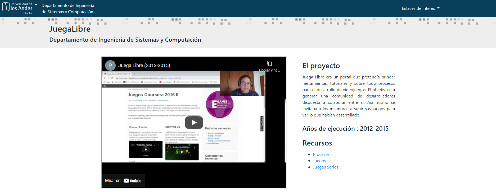
  ```
  
- [Proyecto D.A.V.I.D](https://juegos.virtual.uniandes.edu.co/) 

  ```markdown
  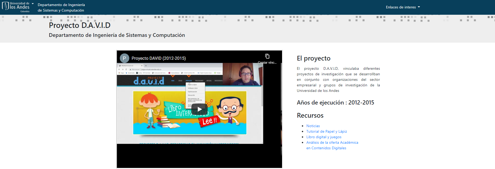
  ```  

- [Jumpcamp](https://jumpcamp.virtual.uniandes.edu.co/) 
  
    ```markdown
  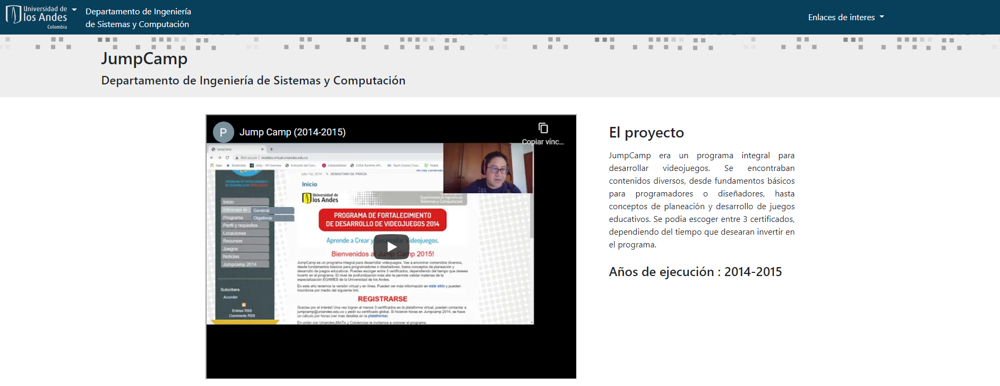
  ```  
  
- [Oro Azul](https://sistemasproyectos.uniandes.edu.co/imagine/MuseoOro/) 

  ```markdown
  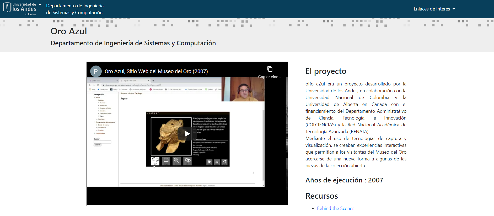
  ```
  

- [Device](https://device.virtual.uniandes.edu.co/) 

  ```markdown
  
  ```

### Events and community management

- [Hackathon Uniandes 2020](https://hackathon-uniandes-2020.devpost.com/) 

  I made constant direct communication with every participant via Discord in order to ensure all of them had a group, gave them access to accounts of different technologies such as Twilio and helped them to get a head start on each of them. I also made different media elements for the competition and ensured that all of the competition's rules were followed.

  ```markdown
  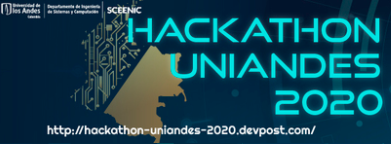
  ```


I had complete control over the following forums, where i solved student's doubts, helped grading their peer reviews, and upgraded course metrics regarding weekly work time, session goals, and others:

- Coursera Forums

  - [Desarrollo de Videojuegos 3D en Unity: Una Introducción](https://www.coursera.org/learn/juegos-3d/home/welcome) 

  ```markdown
  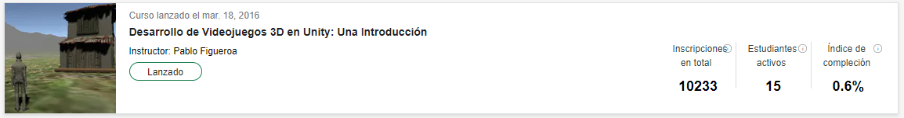
  ```

  - [Desarrollo de Videojuegos en Unity: Una Introducción](https://www.coursera.org/learn/desarrollo-videojuegos-unity/home/welcome) 

  ```markdown
  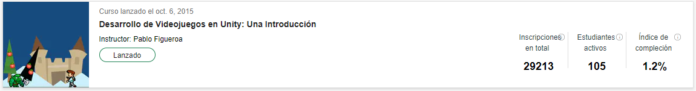
  ```
  
  - [Desarrollo y Diseño de Videojuegos: Proyecto Final](https://www.coursera.org/learn/proyecto-desarrollo-videojuegos/home/welcome) 

  ```markdown
  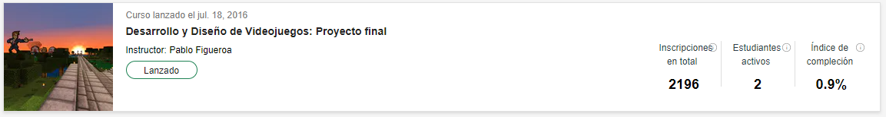
  ```

  - [Diseño de Videojuegos: Una Introducción](https://www.coursera.org/learn/diseno-videojuegos-intro/home/welcome) 

  ```markdown
  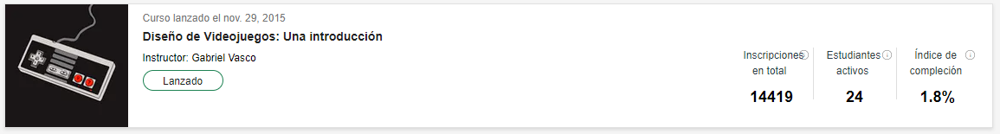
  ```

  - [Emprendimiento y métodos ágiles de desarrollo en videojuegos](https://www.coursera.org/learn/videojuegos-emprendimiento/home/welcome) 

```markdown
  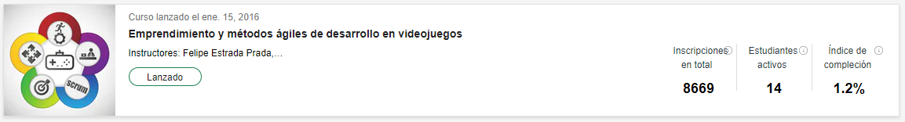
  ```

### Events and community management

- [Cocura](https://www.youtube.com/watch?v=Z3pk4G4yuco&ab_channel=CubxOW) 

  A way to connect users without smartphones or computers to the internet, connecting calls with the Twilio API with web services.  
  
  ```markdown
  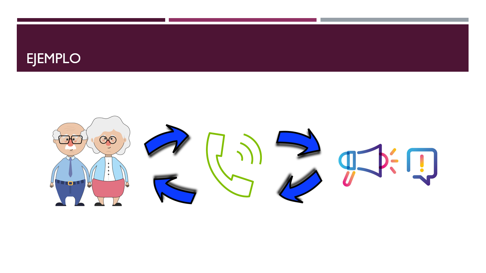
  ```
  
- [3DGameCoursera](https://github.com/dfcubillos10/3DGameCoursera) 

  Swapped versions from the Unity Project that serves as Demo of the Cousera course "Desarrollo de Videojuegos 3D en Unity: Una Introducción" from 2015 to 2020 and solved compatibility issues.

  ```markdown
  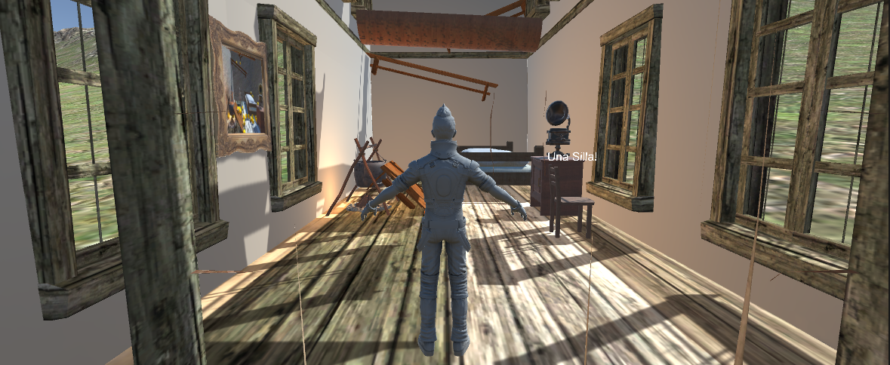
  ```

- Thesis: Extended Business Process Simulator
  
  ```markdown
  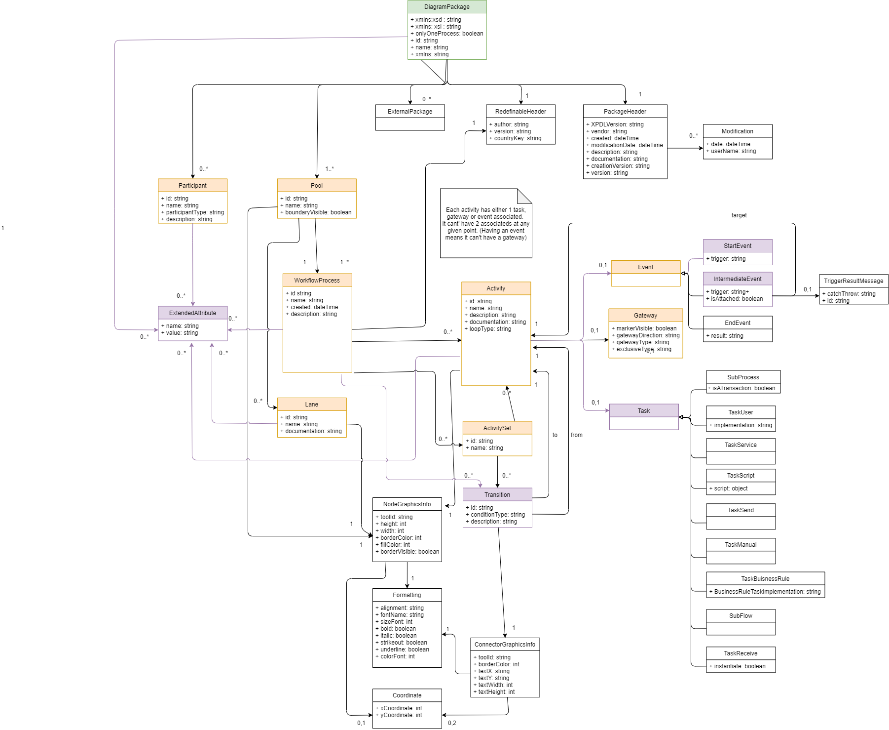
  ```
  
  Taking Bizagi as a base, I made an extended Business Process Simulator that could run multiple processes simoultaneously, use new time events, and understand new decision criteria to select roads to take on gateways.
  
